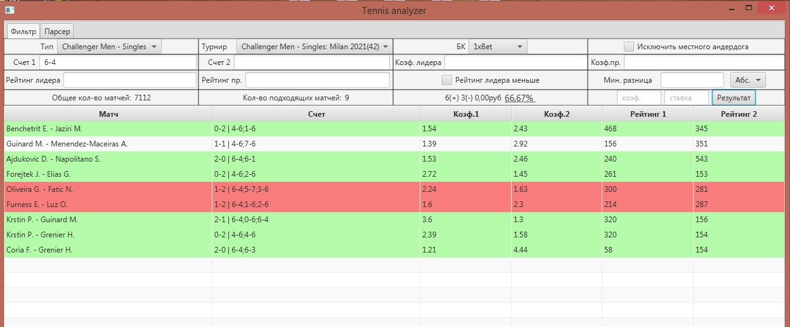
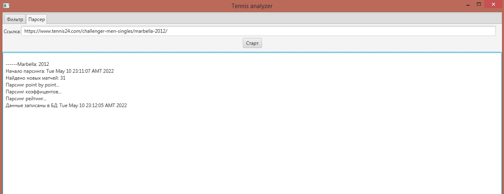

# TennisAnalyzer

## Стек технологии:
JavaFX, Hibernate, H2DB;

## Основные трудности при разработке:
n+1 проблема(join fetch); проблемы связанные с многопоточностью...

## Реализованные паттерны проектирования:
Singleton, Observer, Chain of responsibility;

